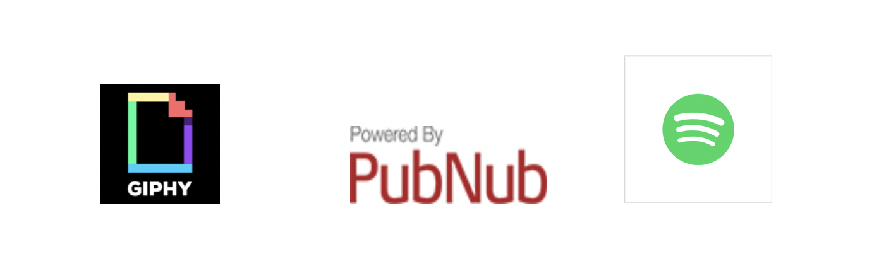
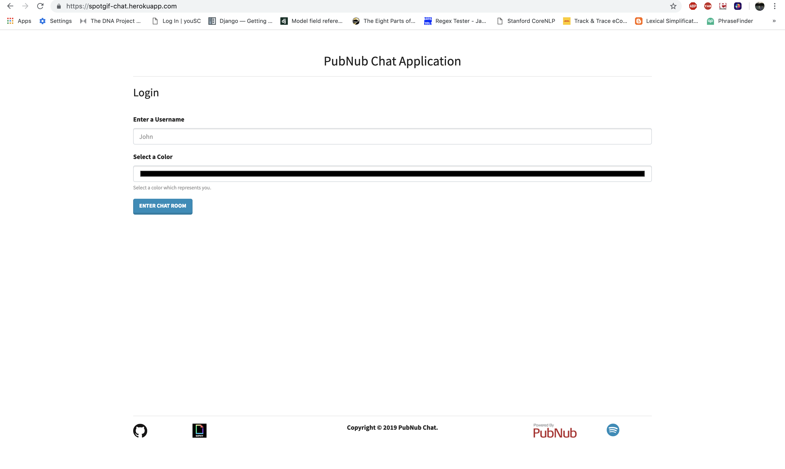

# SpotGif Chat using PubNub Chat Engine SDK

This application allows you to chat with random people in a specific chatroom. Moreover, it allows you to send fun GIFs and emojis which makes the chatting experience more fun with strangers. You can also suggest your friends with new songs and link them directly with spotify.



### Video


### Prerequisites

What things you need to install the software and how to install them

```
node.js
npm
```

### Installing

A step by step series of examples that tell you have to get a development env running

Say what the step will be

```
Install Node.js and npm 
```
[Download Node.js](https://nodejs.org/en)

Check the version using the following commands

```
node -v (6.9.2 +)
npm -v (3.10.9 +)
```

Clone this repository

```
git clone https://github.com/dhruvp-8/pubnub-chat.git
```

Run the following command from the root of the directory

```
npm install
```

To start the project

```
npm start
```

The project should be running on port 5000.

## User Interface


")

## Modules

The application uses three main Modules/APIs:

1. **PubNub ChatEngine SDK**
2. **Spotify API**
3. **Giphy API**

## PubNub ChatEngine SDK

ChatEngine makes it easy to build powerful, cross-platform chat with PubNub. It provides essential components (messages, users, typing indicators), microservices infrastructure (chatbots and programmability) and the network to build and scale production-ready chat apps.

SignUp for your publishKey and subscribeKey by going [here](https://www.pubnub.com/tutorials/chatengine/)

```javascript
ChatEngine = ChatEngineCore.create({
    publishKey: 'Enter-PUB-Key-Here',
    subscribeKey: 'Enter-SUB-Key-Here'
});
```

Creating or joining chat rooms

```javascript

ChatEngine.on('$.ready', (data) => {
    // store my user as me
    me = data.me;
    // create a new ChatEngine chat room
    chat = new ChatEngine.Chat('new-chat');
    // connect to the chat room
    chat.on('$.connected', () => {
        console.log('The chat is connected!');
        // when we receive messages in this chat, render them
        chat.on('message', (message) => {
            console.log('Incoming Message: ', message);
        });
        // send a message to everyone in the chat room
        chat.emit('message', {
            text: "Hi Everyone!"
        });
    });
});
```

Message History

```javascript
chat.on('$.connected', () => {
    // search for 50 old message emits / publishes on the channel
    chat.search({
        reverse: true,
        event: 'message',
        limit: 50
    }).on('message', (data) => {
        // when messages are returned, log them like normal messages
        console.log(data);
    });
});
```

## Calling the Spotify API

First get your client id and client secret from [here](https://developer.spotify.com/)

You these keys to generate an authentication token. Please remember that you do this request from server side that is Node.js which would prevent your client secret from getting exposed.

```javascript
var authOptions = {
  url: 'https://accounts.spotify.com/api/token',
  headers: {
    'Authorization': 'Basic ' + (new Buffer.from(client_id + ':' + client_secret).toString('base64'))
  },
  form: {
    grant_type: 'client_credentials'
  },
  json: true
};

app.get('/token', function(req, res){
	request.post(authOptions, function(error, response, body) {
	  if (!error && response.statusCode === 200) {

	    // use the access token to access the Spotify Web API
	    var token = body.access_token;
	    res.json({'access_token': token});
	  }
	});
});
```

Get the searched song by doing this AJAX call

```javascript
$.ajax({
	url: 'https://api.spotify.com/v1/search?limit=10' + '&q=SONG_NAME&type=track',
	dataType: 'json',
	type: 'get',
	headers: {
		'Accept': '*',
		'Content-Type': 'application/json',
		'Authorization': "Bearer " + res.access_token
	},
	success: function(res){
		song = res.tracks;
		console.log(res.tracks)
	},
	error: function(err){
		console.log(err)			
	}
});
```

## Calling the Giphy API

```javascript
$.ajax({
    url: "https://api.giphy.com/v1/gifs/search?api_key=API_KEY&q=SEARCH_STR",
    type: "GET",
    cache: false,
    timeout: 5000,
    async: false,
    success: function(data) {
      	console.log(data)
    },
    error: function(jqXHR, exception) {
        var msg = '';
        if (jqXHR.status === 0) {
            msg = 'Not connected.\n Verify Network.';
        }
        else if (jqXHR.status == 404) {
            msg = 'Requested page not found. [404]';
        }
        else if (jqXHR.status == 500) {
            msg = 'Internal Server Error [500].';
        }
        else if (exception === 'parsererror') {
            msg = 'Requested JSON parse failed.';
        }
        else if (exception === 'timeout') {
            msg = 'Time out error.';
        }
        else if (exception === 'abort') {
            msg = 'Ajax request aborted.';
        }
        else {
            msg = 'Uncaught Error.\n' + jqXHR.responseText;
        }
        console.log(msg);
    }
  });
```

## Running the tests

No Tests to show currently.


## Deployment

This project is deployed on heroku which uses Amazon Web Services. In order to deploy please follow the [guidelines](https://devcenter.heroku.com/articles/getting-started-with-nodejs) given on the heroku's website for Node.js

## Versioning

I use [SemVer](http://semver.org/) for versioning. For the versions available, see the [tags on this repository](https://github.com/dhruvp-8). 

## Authors

* **Dhruv Patel** - *Initial work* - [dhruvp-8](https://github.com/dhruvp-8)


## License
MIT

